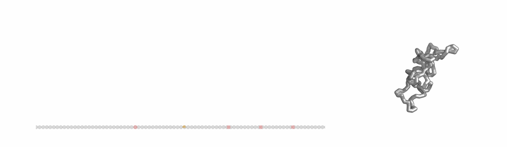

# Chromatin loop extrusion with dynamic boundaries


**Illustration**: This gif demonstrates how long-lived extruders can sequentially bypass a series of dynamic barriers. The process shows contact frequencies between a long-lived barrier acting as an anchor (left site, red) and multiple downstream dynamic barrier positions (right three sites, red).

- **Left**: Lattice implementation where CTCF sites are bound with their binding time, and unbound thereafter. The extruder’s position at the previous time step is depicted as a light arch. If a barrier becomes unbound, an extruder blocked at this site can continue extruding. Note that CTCF can re-bind when the barrier is inside of an extruded loop.
- **Right**: The consequence in 3D genome organization.

### Description
This GitHub repository contains tools for simulating chromatin loop extrusion using a dynamic model of CTCF.

Preprint available here: ** link coming soon **

### Structure of the repository
The structure of this repository follows as below:
- inputs : simulated and experimental data.
- output : files after processing and analyzing the input data.
- analysis: notebooks and code for analyzing simulations and experimental data.
- script: codes for performing simulations.
  
### Requirements
- Polychrom: A toolkit for polymer simulations. (https://github.com/open2c/polychrom)
- OpenMM: A library for molecular simulations. (https://github.com/openmm/openmm)
- Open2C analysis packages. (https://github.com/open2c)

  
## Installation
```
'pip install -e .'
```

### usage
#### running simulaitons 
1. One-Dimensional Lattice Simulation:
Before running the full molecular dynamics simulations, implement loops on a one-dimensional lattice to determine pairs of monomer indices involved in loop extrusion. This step helps define the harmonic 'bonds' input data for the coarse-grained molecular dynamics simulations. Parameters such as the lifetime, velocity, and density of extruders (Cohesins) can be adjusted in the configuration file located at script/simulations/config/simulation_params.py. For CTCF barriers, you can determine dynamic or static barriers, and adjust their parameters such as binding time, unbound time, and/or the occupancy. You can find the Python script for this simulation in the script/simulations directory.

2. Run the coarse-grained molecular dynamics simulations to model loop extrusion. 

#### processing simulation data
After running the simulations, process the simulated trajectory data to generate virtual ChIP-seq profiles, contact maps, and images. The scripts for data processing are available in the ./script/processing directory. For any processing code the instruction is added to the relevant python code.
##### example 
To generate contact maps: 
'''
python script/processing/generate_maps.py
'''

#### analysis
Once the data is processed, perform analyses to quantify observable features such as:

- FRiP (Fraction of Reads in Peaks)
- TADs (Topologically Associating Domains)
- Dots (loops between barriers)
- Vermicelli: Analysis of accumulation of extruders on axial structures.
- P(s): contact frequency vs genomic distance
  
The analysis scripts are provided as Jupyter notebooks in ./analysis directory.
Each notebook includes detailed instructions and examples to guide you through the analysis process.


