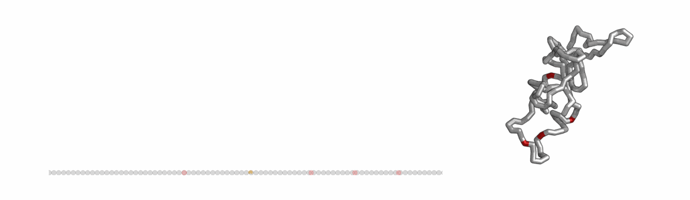

# Chromatin loop extrusion with dynamic boundaries


**Illustration**: This gif demonstrates how extruders (yellow) can sequentially bypass a series of dynamic barriers (red). 

- **Left**: Lattice model showing a simulated genomic region (grey) with a long-lived barrier acting as an anchor (left site, red) and multiple downstream dynamic barrier positions (right three sites, red). The two genomic positions held together by the extruder is depicted with a light arch. If a barrier becomes unbound, an extruder blocked at this site can continue extruding. Note that CTCF can re-bind when the barrier is inside of an extruded loop.
- **Right**: The consequence on 3D genome organization.

### Description
This GitHub repository contains tools for simulating chromatin loop extrusion using a dynamic model of CTCF.

Preprint available here: ** link coming soon **

### Structure of the repository
The structure of this repository follows as below:
- inputs : simulated and experimental data.
- output : files after processing and analyzing the input data.
- analysis: notebooks and code for analyzing simulations and experimental data.
- scripts: codes for performing simulations.
  
### Requirements
- *Polychrom*: A toolkit for polymer simulations. (https://github.com/open2c/polychrom)
- *OpenMM*: A library for molecular simulations. (https://github.com/openmm/openmm)
- *Open2C* analysis packages (see https://github.com/open2c)

  
## Installation
First, 

```
git clone https://github.com/Fudenberg-Research-Group/dynamic_extrusion_boundaries.git
```
after navigating to the folder:
```
pip install -e .
```

### Workflow
#### Running simulations 
See `./scripts/simulations` for relevant code. 
1. One-Dimensional Lattice Simulation: Parameters such as the lifetime, velocity, and density of extruders can be adjusted in the configuration file located at `scripts/simulations/simulation_1d.py`. Barriers can be specified as either dynamic or static barriers, and adjust their parameters such as binding time, unbound time, and/or the occupancy. 

2. Run the coarse-grained molecular dynamics simulations to model loop extrusion. Uses extruder positions from 1D lattice simulations as an input. 

#### Processing simulation data
After running the simulations, the simulated trajectories can be processed to generate *in silico* ChIP-seq profiles, contact maps, and microscopy images. Scripts for data processing available in `./scripts/processing`. Instructions are provided with the relevant python code.

#### Analysis
Once the data is processed, observable features can be quantified, including:

- FRiP (Fraction of Reads in Peaks)
- TADs (Topologically Associating Domains)
- Dots (loops between barriers)
- Vermicelli (accumulation of extruders on axial structures)
- P(s): contact frequency vs genomic distance
  
See Jupyter notebooks in `./analysis`.


